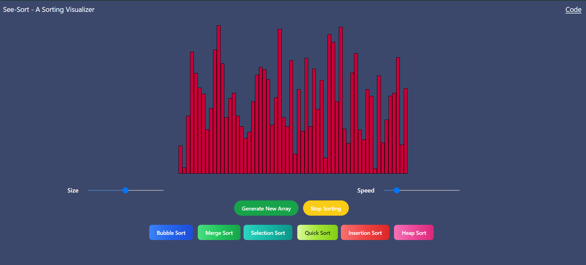
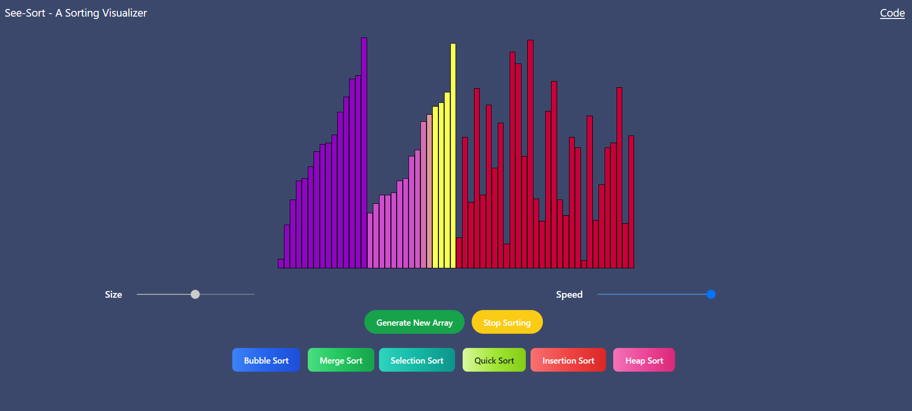
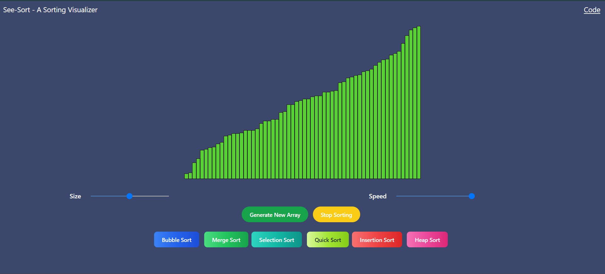

# See-Sort

See-Sort is a sorting visualizer that dynamically demonstrates various sorting algorithms to provide a visual understanding of their operations.

## Table of Contents

- [Introduction](#introduction)
- [Features](#features)
- [Supported Sorting Algorithms](#supported-sorting-algorithms)
- [Demo](#demo)
- [Usage](#usage)

## Introduction

See-Sort is designed to help users visualize the inner workings of different sorting algorithms. By providing a graphical representation of the sorting process, users can gain a better understanding of how these algorithms operate and make decisions.

## Features

- Real-time visualization of sorting algorithms.
- Adjustable speed for better comprehension.
- User-friendly interface.

## Supported Sorting Algorithms

See-Sort currently supports the following sorting algorithms:

- Bubble Sort
- Merge Sort
- Selection Sort
- Quick Sort
- Insertion Sort
- Head Sort

## Demo





To see See-Sort in action, check out the [live demo](https://see-sort.vercel.app/).


## Usage

1. Clone the repository:

   ```bash
   git clone https://github.com/deepencoding/See-Sort.git
   
2. Open index.html in your preferred web browser.

3. Adjust the speed slider to control the visualization speed.
   
4. Adjust the size slider to resize the array.

5. Choose a sorting algorithm from the buttons to start sorting.
